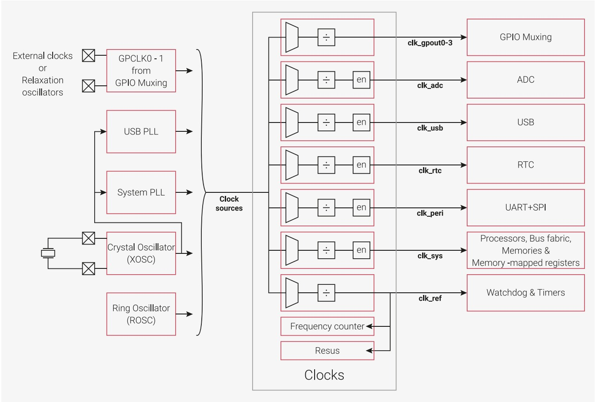

# Raspberrt Pico Power Saving

Raspberry Pi Pico power saving usage examples:

- Sleep mode
- Underclock
- Hybrid

Lowest achieved consumption without using sleep mode (underclock) is around 5.5 mA. Deep sleep
achieves around 2 mA.

Minimal clock achieved for Rasperry Pico was ~15MHz.

## Related

Raspberry Pico documentation is amazing. Check chapters Power Control and Clocks
of RP2040 datasheet for a better understanding of MCU internals.

For clocks,
- [pico-sdk API - hardware_clocks](https://www.raspberrypi.com/documentation/pico-sdk/hardware.html#hardware_clocks)
- [pico-sdk API - hardware_vreg](https://www.raspberrypi.com/documentation/pico-sdk/hardware.html#hardware_vreg)
- [pico-examples by hermann](https://github.com/Hermann-SW/pico-examples)
  - Watch hang and multi-hang exampes. Help to understand valid clock configurations.
  - Original post [Link](https://forums.raspberrypi.com/viewtopic.php?t=307533)

For deep sleep,
- [SleepyPico](https://github.com/ms1963/SleepyPico)
- [Awaking the Raspberry Pico from deep sleep](https://ghubcoder.github.io/posts/awaking-the-pico/)
- [PicoSleepDemo](https://github.com/ghubcoder/PicoSleepDemo/blob/master/main.c)

## Sidenote for power optimizer geeks seeking for sub - 5 mA non-sleep current draw

Record low underclocked non-sleep current consumption of 4.5 mA was observed when +5V was connected to VSYS rail instead of VBUS one to evade Shottky diode which adds some power loss by itself. But please pay attention: your mileage may vary because of manufacturing variations. Also you will lose reverse polarity protection in this case.
